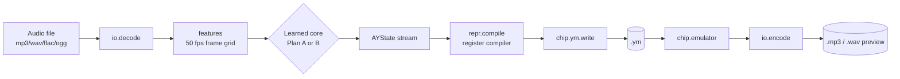

# audio2ay4 — Design

**Goal.** Convert instrumental audio (mp3 / wav / flac / ogg / …) into a **hardware-legal
50 Hz AY-3-8910 / YM2149 register stream** (`.ym`), and render any `.ym` back to audio for
**preview** (`.mp3` / `.wav`). The conversion intelligence is **learned from the existing corpus
of YM tunes** instead of hand-written heuristics.

This folder holds **two competing solution plans**. They share one common foundation (described
here) and differ only in the learned core:

| Plan | Core idea | Read |
|------|-----------|------|
| **A — Reinforcement Learning** | Train a *reverse player* `audio → registers`; reward = "when I re-render my registers, do they **sound like** the input?" Optional supervised warm-start. | [plan-a-reinforcement-learning.md](plan-a-reinforcement-learning.md) |
| **B — Diffusion** | Conditional diffusion that denoises an AY control-stream conditioned on time-aligned audio features; optional emulator guidance for faithfulness. | [plan-b-diffusion.md](plan-b-diffusion.md) |

Both plans **reuse the validated chip core and YM I/O proven in audio2ay3** (the emulator is the
ground truth for training, evaluation, and preview) and both emit registers through the **same
deterministic legality layer**, so output is always playable on real hardware.

> **Provenance.** audio2ay4 builds on **[audio2ay3](https://github.com/parallelno/audio2ay3)** — a
> mature, modular, well-organized Python project with a **proven AY-3-8910 / YM2149 emulator** and
> complete YM I/O. We **reuse that emulator, YM read/write, and legal-register encoder as-is** (the
> trusted ground truth for training, evaluation, and preview) rather than reinventing them. See the
> audio2ay3 repo's `src/` and `design/` for the reference implementation being ported.

---

## 1. Design principles (apply to both plans)

1. **Emulator is ground truth.** The same trusted emulator validates YM files, generates training
   audio, scores fidelity, and renders previews. "What we measure" equals "what a chip produces."
2. **Legal registers only, structurally.** A single deterministic *register compiler* is the one
   choke point that guarantees hardware-legal output. No learned component can emit an illegal
   frame.
3. **No post-AY processing.** Quality is won in the register stream, never by EQ/reverb/compression
   on rendered audio. The only thing between the emulator and the MP3 encoder is the encoder.
4. **Modular, contract-first.** Every stage communicates through a small, typed, versioned data
   contract (§4). Any stage can be swapped, mocked, or tested in isolation.
5. **Deterministic where it matters.** Given a fixed seed and config, inference is reproducible
   (critical for regression tests and A/B research).
6. **Learned core, hard-coded safety.** Models propose; the compiler disposes. The proven
   `audio2ay3` core is the safety net and the oracle.

---

## 2. System architecture (shared)



Everything left of the learned core is shared, deterministic preprocessing. Everything right of it
(`AYState → registers → .ym → audio`) is shared, deterministic, hardware-faithful reproduction.
**Only the boxed "Learned core" differs between Plan A and Plan B.**

### 2.1 Package layout

```
audio2ay4/
├─ src/audio2ay4/
│  ├─ io/            # audio decode/encode (ffmpeg/soundfile), format sniffing
│  ├─ chip/          # AY emulator (ground truth), YM read/write, AY constants & legality
│  │  └─ diff/       # differentiable AY surrogate (Plan A); shared DDSP oscillators
│  ├─ features/      # audio → 50 fps feature front-end (mel / CQT / EnCodec adapters)
│  ├─ repr/          # AYState dataclasses, tokenizer, register compiler (AYState↔registers)
│  ├─ data/          # corpus ingest, YM→audio pairing, augmentation, torch Datasets
│  ├─ models/
│  │  ├─ policy/     # Plan A: reverse-player networks
│  │  └─ diffusion/  # Plan B: denoiser + audio encoder + sampler
│  ├─ train/         # losses, rewards, training loops, checkpoints, schedules
│  ├─ convert/       # inference: audio → .ym (orchestrates a learned core + compiler)
│  ├─ preview/       # .ym → audio → mp3/wav
│  ├─ eval/          # perceptual metrics, A/B harness, regression gates
│  ├─ config.py      # typed RunConfig / TrainConfig (pydantic), seeds
│  └─ cli.py         # convert | preview | validate | train | eval
├─ tests/            # unit + golden-file + property tests
├─ samples/          # curated audio + reference .ym fixtures
└─ design/           # this folder
```

A learned core is just an implementation of one interface (§4.3), so `convert`/`preview` are
identical for both plans — you select the backend by config (`core: rl | diffusion`).

---

## 3. Target hardware model (shared)

| Aspect | Spec |
|--------|------|
| Chip | AY-3-8910 / YM2149 |
| Tone channels | 3 × 12-bit period (A, B, C) |
| Noise | 1 shared, 5-bit period |
| Envelope | 1 shared: 16-bit period + 4-bit shape (R13) |
| Mixer | R7 — per-channel tone/noise enable (active-low) |
| Volume | per channel 4-bit **logarithmic** DAC + "use envelope" bit |
| Frame rate | 50 Hz (20 ms/frame); 100 Hz optional |
| Default clock | 1.7734 MHz (ZX); configurable |

The **single shared envelope** and **single shared noise** generators are the hard scarcity that
the learned core and the register compiler must arbitrate — this is the central engineering
problem in both plans.

---

## 4. Stage contracts (shared, versioned data types)

Typed, serializable contracts make every stage independently testable and swappable. (Shown as
dataclasses; persisted as versioned `.npz`/`.json` for golden-file tests.)

### 4.1 Audio + features

```python
@dataclass
class AudioBuffer:           # io.decode output
    pcm: Float[Array, "samples channels"]
    sample_rate: int
    duration_s: float

@dataclass
class FeatureFrames:         # features.* output — frame-aligned to frame_rate
    feats: Float[Array, "frames feat_dim"]   # mel / CQT / EnCodec latents
    frame_rate: int                          # 50
    feat_kind: str                           # "mel" | "cqt" | "encodec"
```

### 4.2 AYState (the smooth intermediate representation — shared by both plans)

Higher-level than registers, **perceptually smooth**, and the single thing the learned core emits.

```python
@dataclass
class AYVoiceFrame:
    pitch_semitones: float    # continuous; -inf/NaN = silent
    volume_db: float          # perceptual; compiler maps to 4-bit log DAC
    tone_on: bool
    noise_on: bool
    use_envelope: bool

@dataclass
class AYGlobalFrame:          # the SHARED resources, modelled once (not per voice)
    noise_pitch: float        # → 5-bit noise period
    env_shape: int            # 0..15 categorical (R13)
    env_rate: float           # → 16-bit envelope period
    env_retrigger: bool       # write R13 this frame?

@dataclass
class AYStateFrame:
    voices: tuple[AYVoiceFrame, AYVoiceFrame, AYVoiceFrame]
    glob: AYGlobalFrame

AYState = list[AYStateFrame]  # length = n_frames
```

### 4.3 Learned-core interface (the only thing Plan A and Plan B implement differently)

```python
class LearnedCore(Protocol):
    def infer(self, feats: FeatureFrames, cfg: RunConfig) -> AYState: ...
```

### 4.4 Registers + song

```python
RegisterStream = UInt8[Array, "frames 16"]   # raw AY register snapshots

@dataclass
class YmSong:
    regs: RegisterStream
    master_clock_hz: float
    frame_rate_hz: int
    loop_frame: int | None
    meta: dict   # name/author/comment
```

`repr.compile(AYState, RunConfig) -> YmSong` is deterministic and is the **sole** producer of
register values; it owns every legality clamp and the shared-resource arbitration policy.

---

## 5. Shared subsystems

### 5.1 chip/ — emulator + YM I/O (port the proven [audio2ay3](https://github.com/parallelno/audio2ay3) core)
- **Emulator:** cycle/frame-accurate AY → PCM. Ground truth for data gen, eval, preview. Frozen
  and golden-file tested against reference YM renders. Ported from
  [audio2ay3](https://github.com/parallelno/audio2ay3) (already validated against ST-Sound / MAME).
- **YM reader/writer:** YM2/3/3b/5/6 + transparent LHA depack; round-trip tested.
- **Legality oracle:** `is_legal(RegisterStream) -> bool` used as a hard test gate everywhere.

### 5.2 features/ — audio front-end
- Decode → mono working signal + retained stereo; loudness-normalize (−23 LUFS) so thresholds are
  content-independent.
- Produce 50 fps features: **mel-spectrogram** (default, cheap, parameter-free), **CQT**
  (log-frequency, music-aligned), or **EnCodec/learned latents** (richest). Pluggable via
  `feat_kind`; the learned core declares which it consumes.

### 5.3 repr/ — AYState ↔ registers
- **Register compiler** (`AYState → YmSong`): pitch→12-bit period (cents-aware), volume→4-bit log
  DAC (measured table), noise→5-bit, envelope→R13+16-bit, mixer bits, with octave-folding and
  clamping. **Arbitrates the shared envelope/noise** when voices contend (priority policy +
  config). Pure, deterministic, exhaustively unit-tested.
- **Inverse parser** (`YmSong → AYState`): needed to build training targets from corpus YM files.
- **Tokenizer** (Plan B / optional Plan A): AYState ↔ token tensors (continuous channels + small
  categoricals), plus the **delta + keyframe + event-channel** scheme.

### 5.4 data/ — corpus & pairing (shared training infrastructure)
- Ingest the public YM corpus (Modland YM, zxart/zxtunes, VTX/PSG archives), dedup, filter to
  AY-3-8910/YM2149, normalize clock/frame-rate. Bulk-fetch the Modland YM set with
  `scripts/download_modland_ym.py` (see `corpus/README.md` for sources and usage).
- **Render YM → audio** with the emulator to produce `(audio, AYState/registers)` **pairs** — the
  free, unlimited supervised signal both plans build on.
- Augmentation: clock/tempo jitter, gain, light reverb/codec degradation on the audio side to
  harden the audio encoder.
- Deterministic train/val/test splits **by tune** (no leakage across the same song).

### 5.5 eval/ — metrics & regression
- **Perceptual fidelity:** multi-scale spectral distance + a learned audio-embedding distance
  (CLAP-style) between input audio and rendered output.
- **Musical:** melody/chroma recall vs a reference transcription where available; onset alignment.
- **Stability:** frame-to-frame jitter rate (period/volume thrash).
- **Legality:** 100% of emitted `.ym` pass the legality oracle and load in an independent player.
- All wired into CI as **regression gates** on the curated `samples/` set.

### 5.6 cli.py
```
audio2ay4 convert in.mp3 -o out.ym [--core rl|diffusion] [--clock HZ] [--frame-rate HZ]
audio2ay4 preview in.mp3 -o out.mp3            # convert then render
audio2ay4 validate song.ym  -o song.mp3        # render only (no model) — always available
audio2ay4 train  <plan>    --config cfg.yaml   # training entry points
audio2ay4 eval   <run>     --suite samples/    # metrics + regression report
```
`validate` has **zero learned dependencies** and is the always-on smoke test.

---

## 6. Cross-cutting quality requirements

| Requirement | How both plans meet it |
|-------------|------------------------|
| **Modular** | Typed stage contracts (§4); learned core behind one `LearnedCore` interface; backends selected by config. |
| **Maintainable** | Proven chip core reused & frozen; pure deterministic compiler isolated from stochastic models; config as typed schema. |
| **Testable** | Unit tests per pure module; golden-file tests for emulator/compiler; property tests for legality; mockable core for pipeline tests; metric regression gates in CI. |
| **Performant** | GPU batch inference; chunked/segmented processing of long tracks; emulator vectorized; features cached; offline batch (no real-time constraint on conversion). |
| **Robust** | Legality compiler guarantees playable output regardless of model behavior; boundary validation only at system edges (decode, file I/O); graceful fallback to deterministic baseline if a model is absent. |

---

## 7. Shared Milestone 0 (do before either plan diverges)

0. **Port & freeze the chip core** (emulator + YM I/O) from `audio2ay3`; golden-file tests green.
1. **Register compiler + inverse parser**, with the shared-resource arbitration policy; property
   tests prove legality on random AYState.
2. **Feature front-end** (mel first) at 50 fps with cached outputs.
3. **Data pipeline**: corpus ingest + YM→audio pairing + splits.
4. **Eval harness + `validate`/`preview` paths** working end-to-end with a trivial dummy core.

Only after Milestone 0 is green do Plan A and Plan B add their learned cores — both drop straight
into the same `LearnedCore` slot.

---

## 8. Choosing between the plans

| Dimension | Plan A — RL | Plan B — Diffusion |
|-----------|-------------|--------------------|
| Primary objective | Directly optimizes "sounds like the input" (reward). | Matches data distribution; faithfulness via guidance. |
| Training stability | Harder (RL variance) unless differentiable emulator used. | More stable (supervised denoising objective). |
| Faithfulness control | Intrinsic (reward is the metric). | Classifier-free guidance + optional emulator guidance. |
| Idiomatic output | From corpus warm-start + reward shaping. | Strong — learns the corpus distribution natively. |
| Determinism | Deterministic policy at inference. | Deterministic with fixed seed + ODE sampler. |
| Compute at inference | Single forward pass (fast). | Iterative sampling (slower, offline-OK). |
| Biggest risk | Reward hacking / RL instability. | Discrete fields + drift in delta space. |

These are **not mutually exclusive**: Plan A's supervised warm-start (#3) and Plan B's diffusion
decoder can share the same data pipeline and register compiler, and Plan B sampling can be guided
by the same emulator Plan A optimizes against. Build Milestone 0 once; prototype both cores; let
the eval harness pick the winner.
