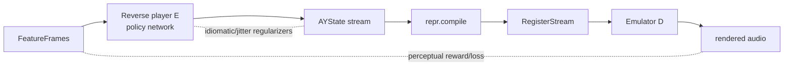

# Plan A — Reinforcement-Learning Reverse Player

> Train a **reverse AY player**: a network `E` that maps audio → an AY control-stream, trained so
> that **when its output is rendered back through the emulator, it sounds like the input**. The
> reward is perceptual audio similarity, not exact register copying — so any of the many register
> streams that reproduce the sound is acceptable. An optional **supervised warm-start** (#3) makes
> training fast and stable.

Read [README.md](README.md) first — this plan only specifies the **learned core** that drops into
the shared `LearnedCore` slot; all I/O, the emulator, the register compiler, data pairing, and
evaluation are shared.

---

## A.1 Thesis

The hard, quality-limiting problem in `audio2ay3` was the hand-written **arrangement** stage
(which 3 notes survive, how the one envelope/noise is shared). Plan A replaces that hand-tuning
with a policy that learns arrangement implicitly by being rewarded for *sounding right*. Because
register values are discrete and the true objective is perceptual, this is naturally a
**reinforcement-learning** problem; we also provide a lower-variance **differentiable** reformulation.



At inference only `A → E → S → compile → .ym` runs (one forward pass). The emulator loop is a
**training-time** construct.

---

## A.2 The reverse player `E`

- **Input:** `FeatureFrames` (mel/CQT/EnCodec at 50 fps) plus a short look-ahead/look-behind
  context window.
- **Body:** a temporal sequence model — a **non-causal Transformer or temporal-conv (TCN) U-Net**
  over frames (non-causal is fine: conversion is offline, so the model may see the whole track).
  Chunked with overlap for long songs (§A.9).
- **Heads (emit `AYStateFrame` per frame):**
  - Continuous: `pitch_semitones`, `volume_db`, `noise_pitch`, `env_rate` (regressed).
  - Gates (Bernoulli logits): `tone_on`, `noise_on`, `use_envelope`, `env_retrigger`.
  - Categorical: `env_shape` (16-way softmax).
- **Output → AYState**, then the shared deterministic **register compiler** legalizes it. `E`
  never sees raw registers; it works in the smooth AYState space so its outputs are perceptually
  well-behaved.

> Design choice: `E` emits **AYState**, not registers. This keeps the learned space smooth and
> pushes all legality/arbitration into the deterministic compiler, where it is testable.

---

## A.3 Two training regimes (same `E`, same reward)

The objective is identical; only how the learning signal reaches `E` differs.

### Regime 1 — Differentiable analysis-by-synthesis (preferred)
Make the emulator path **differentiable** (`chip/diff/`, a DDSP-style band-limited square + noise
+ envelope synth that matches the trusted emulator). Relax `E`'s discrete heads with
**Gumbel-softmax / straight-through estimators** so gradients pass through `compile` and `D`.
Then train with plain backprop on a perceptual reconstruction loss. Low variance, fast
convergence. This is the default.

### Regime 2 — Black-box RL (fallback)
If a faithful differentiable emulator proves too costly, treat the **trusted emulator as a
non-differentiable environment** and train `E` as a policy with **PPO** (continuous heads as a
diagonal-Gaussian policy, discrete heads as categorical). Reward = perceptual similarity (§A.4).
Higher variance, slower, but needs no differentiable chip. Use frame-windowed episodes with
reward-to-go to keep credit assignment local.

> Both regimes optimize the *same* reward and produce the *same* kind of policy; pick per the
> cost/accuracy of building `chip/diff/`. They can also be staged: pretrain (#3) → Regime 1 →
> optional PPO polish.

---

## A.4 Reward / loss

Computed between the **input audio** and the **re-rendered output audio**, in a
**timbre-invariant** space (the chip can never match a recording's spectrum, so the metric must
reward pitch/rhythm/harmony, not raw spectral equality):

```
L = w1 · multiscale_spectral(A, Â)        # multi-resolution STFT/mel L1 — coarse-to-fine
  + w2 · embedding_distance(A, Â)          # CLAP-style learned audio embedding (timbre-invariant)
  + w3 · chroma/onset_alignment(A, Â)      # melody & rhythm adherence
  + λ_jit · jitter_penalty(S)              # frame-to-frame period/volume thrash (stability)
  + λ_idi · idiomatic_penalty(S)           # optional: corpus prior (see A.6)
  + λ_leg · compile_cost(S)                # discourages states that the compiler must clamp hard
```

`jitter_penalty` is the learned replacement for `audio2ay3`'s hand-tuned hysteresis/slew limiting:
stability becomes part of the objective rather than a post-hoc rule.

**Anti-reward-hacking:** because the metric is imperfect, `E` could find weird states that score
well but sound bad. Mitigations: the timbre-invariant embedding term, the jitter/idiomatic
penalties, and clamping the differentiable emulator's expressiveness to the real chip's so it
can't be gamed by sub-frame tricks.

---

## A.5 Optional supervised warm-start (#3)

Before reward training, pretrain `E` on the `(chip-rendered audio, AYState)` pairs from the shared
data pipeline with a straightforward supervised loss (regress continuous heads, cross-entropy on
categorical/gates against the parsed AYState). This:
- gives `E` a competent initialization (the rough audio→state mapping),
- dramatically shortens and stabilizes the reward phase,
- and provides a **deterministic fallback core** on its own.

Limitation (by design): warm-start input is *chip* audio, so it does not generalize to real
instruments alone — that is exactly what the reward phase on real/augmented audio corrects.

---

## A.6 Optional idiomatic regularizer

`λ_idi · idiomatic_penalty(S)` may use a small, **optional** AYState prior (a tiny autoregressive
model of corpus AYState) to penalize un-chiptune-like states. Off by default; enable only if
reward hacking shows up. (This is the deliberately-optional "critic" from earlier discussion.)

---

## A.7 Differentiable emulator (`chip/diff/`)

A separate, differentiable synth that *approximates* the trusted emulator for gradients only:
- band-limited square oscillators (additive odd-harmonic, differentiable in frequency & amplitude),
- filtered-noise generator,
- differentiable hardware-envelope LFO,
- the **measured 4-bit log DAC** as a smooth interpolant.

Validated by matching the trusted emulator's output on random register streams (golden-file
tolerance). **It is never used for the final render** — `preview`/eval always use the trusted
emulator. This keeps "training proxy" and "ground truth" cleanly separated.

---

## A.8 Inference pipeline

```
convert:  audio → io.decode → features → E.infer → AYState → repr.compile → chip.ym.write → .ym
preview:  …→ .ym → chip.emulator → io.encode → .mp3/.wav
```
Single forward pass through `E`; deterministic compiler; the trusted emulator for preview. No RL,
no differentiable emulator at inference.

---

## A.9 Performance

- **Offline batch** — no real-time constraint on conversion; optimize throughput, not latency.
- **GPU batch inference**; **chunked** processing of long tracks with overlap-add on AYState
  (cross-fade gates/pitch at chunk seams to avoid boundary clicks).
- Feature extraction cached to disk; emulator vectorized for fast reward rollouts.
- Differentiable-emulator rollouts batched across frames; PPO (if used) runs many parallel
  emulator environments.

---

## A.10 Robustness & risks

| Risk | Mitigation |
|------|------------|
| RL instability / high variance | Prefer differentiable Regime 1; warm-start with #3; PPO with normalized advantages + KL control if used. |
| Reward hacking (sounds-bad-but-scores-well) | Timbre-invariant embedding term; jitter/idiomatic penalties; constrain diff-emulator to real-chip limits. |
| Differentiable emulator inaccuracy | Validate against trusted emulator; use only for gradients; straight-through for discrete steps; never render with it. |
| Domain gap (chip-audio → real audio) | Reward phase trains on real + augmented audio; codec/reverb/gain augmentation; optional small set of real refs. |
| Illegal/unstable output | Deterministic register compiler guarantees legality; jitter penalty + compiler clamps. |
| Long-track seams | Overlapping chunks + AYState cross-fade; continuity term across seams. |

---

## A.11 Testing strategy

- **Pure modules** (compiler, features, YM I/O, reward terms): unit + property tests; legality
  proven on random AYState.
- **Differentiable emulator:** golden-file match to the trusted emulator within tolerance;
  gradient finite-difference checks.
- **`E` (model):** overfit-one-track test (must drive reconstruction loss → near zero on a single
  sample) as the canary that the whole loop is wired correctly.
- **Pipeline:** mock `E` to test `convert`/`preview` end-to-end without training.
- **Regression gates (CI):** perceptual/jitter/legality metrics on `samples/` must not regress.

---

## A.12 Roadmap

| Phase | Deliverable |
|-------|-------------|
| A0 | Shared Milestone 0 complete (README §7). |
| A1 | `E` skeleton + heads + AYState emission; mock-trained; pipeline green. |
| A2 | Supervised warm-start (#3) on corpus pairs; deterministic baseline core usable. |
| A3 | Differentiable emulator (`chip/diff/`) validated against ground truth. |
| A4 | Regime 1 reward training (analysis-by-synthesis); overfit-one-track passes; spectral+embedding reward online. |
| A5 | Real/augmented-audio reward phase; jitter/idiomatic regularizers; preset tuning. |
| A6 | (Optional) PPO polish; dual-AY / 100 Hz extensions; perf hardening. |

---

## A.13 Open questions

- Best timbre-invariant reward embedding (CLAP vs a domain-tuned encoder)?
- Is a faithful **differentiable** AY cheap enough to keep Regime 1 the default, or is PPO needed?
- How much real-audio data is required in the reward phase to close the domain gap?
- Window/chunk size trade-off between long-range musical context and memory.
