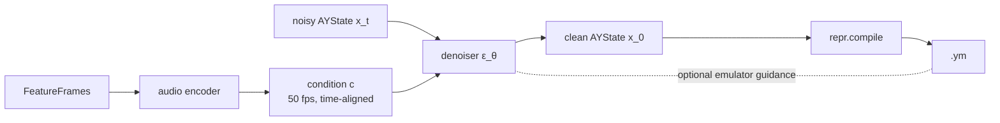

# Plan B — Conditional Diffusion

> A **conditional diffusion** model denoises an AY **control-stream** (AYState), conditioned on a
> **time-aligned audio embedding**. It is *image-to-image-style* diffusion: the "prompt" slot is
> filled by a dense, frame-registered audio feature sequence, not text. **Classifier-free
> guidance** dials faithfulness up; **optional emulator guidance** at sampling time fuses in the
> "sounds-like-the-input" objective.

Read [README.md](README.md) first — this plan specifies only the **learned core** that drops into
the shared `LearnedCore` slot. I/O, emulator, register compiler, data pairing, and evaluation are
shared.

---

## B.1 Thesis

Diffusion natively learns the **distribution of real AY tunes** and generates whole streams
jointly (capturing long-range song structure), which makes its output idiomatic by construction.
The two known weaknesses — *register space is not perceptually smooth* and *faithfulness to a
specific input* — are solved by (1) diffusing a **smooth AYState representation** rather than raw
registers, and (2) **classifier-free + emulator guidance**.



---

## B.2 Representation (the decisive design choice)

**Do not diffuse raw registers** (heterogeneous, non-perceptual, categorical fields). Diffuse
**AYState** (README §4.2), in a smooth, perceptual parameterization:

- **Continuous channels** (Gaussian diffusion): `pitch_semitones`, `volume_db`, `noise_pitch`,
  `env_rate`. Perceptually scaled so equal steps ≈ equal perceived change.
- **Discrete channels** (handled separately): `tone_on`, `noise_on`, `use_envelope`,
  `env_retrigger` (Bernoulli), `env_shape` (16-way categorical) → **discrete diffusion (D3PM /
  multinomial)** or relax-and-threshold.
- **Delta parameterization** for the smooth channels (from "Idea #3"): model per-frame *changes*,
  so "hold the note" (Δ≈0) is the default — directly suppressing jitter. Guarded against drift by:
  - **absolute keyframes** every K frames (re-anchor the integration), and
  - a discrete **event channel** for the non-smooth moments (onsets, gate flips, env retrigger)
    that deltas model badly.
- **Shared resources modelled once:** the single envelope and single noise live in `AYGlobalFrame`
  (not per voice), so the model can't propose three conflicting envelopes; the compiler still owns
  final arbitration.

This is the smooth space diffusion actually needs, while the **register compiler** (shared,
deterministic) handles the ugly mapping to legal registers.

---

## B.3 Audio conditioning (no prompts — dense, time-aligned)

The condition `c` is **not** a global text vector; it is a **same-length, frame-registered** audio
embedding, making this closer to image-to-image / source-separation diffusion than to text→image.

1. **Audio encoder:** input audio → per-frame features at 50 fps (mel default; CQT; or learned
   EnCodec/HuBERT latents), trained jointly with the denoiser. Output length = AYState length.
2. **Injection into the denoiser** (1D U-Net or Transformer over frames), combined:
   - **per-frame concatenation** of `c[t]` onto the noisy state `x_t[t]` (exploits exact alignment),
   - **cross-attention** so each output frame attends to a *window* of audio (context, slight
     misalignment tolerance),
   - optional **FiLM** modulation of normalization layers.

```
audio ──encoder──► c[0..T]  (50 fps, aligned 1:1 to AYState frames)
                        │  concat + cross-attention (+ FiLM)
 noisy AYState x_t ──► [ denoiser ε_θ(x_t, t, c) ] ──► x_0
```

---

## B.4 Denoiser architecture

- **Backbone:** 1D U-Net with attention (or a diffusion Transformer) over the frame axis; receptive
  field large enough for musical phrases; chunked with overlap for long tracks.
- **Mixed continuous/discrete heads:** Gaussian ε-prediction (or v-prediction) for continuous
  channels; a parallel **discrete-diffusion** branch (or relaxed-Bernoulli/categorical) for gates,
  `env_shape`, and the event channel. A shared trunk, split output heads.
- **Timestep + condition embeddings** injected via adaptive norm.

---

## B.5 Classifier-free guidance (the faithfulness dial)

Train with the audio condition randomly dropped (null embedding). At sampling:

```
ε = ε_uncond + w · (ε_cond − ε_uncond)
```

Increasing `w` tightens adherence to *this* song (analogous to prompt strength). This is the
primary knob that turns "plausible chiptune" into "a faithful cover of the input."

---

## B.6 Optional emulator guidance (fuse in the perceptual objective)

At each denoising step, estimate `x̂_0`, **compile + render** it through the (differentiable or
finite-difference) emulator, and nudge the sample to reduce the perceptual distance to the input
audio (reconstruction guidance):

```
x_t ← x_t − s · ∇_{x_t} perceptual_distance( render(compile(x̂_0)), A )
```

This literally injects Plan A's "sounds-like-the-input" reward into diffusion sampling — the two
plans converge here. Optional; off for pure-generative speed, on for maximum fidelity.

---

## B.7 Training

Standard conditional-diffusion training on the shared `(chip-rendered audio, AYState)` pairs:
1. Sample a pair `(A, x_0)`; parse YM → AYState; encode `A → c`.
2. Sample timestep `t`; add noise `x_0 → x_t` (Gaussian for continuous, D3PM for discrete).
3. Train `ε_θ` to denoise given `(x_t, t, c)`; the audio encoder trains jointly.
4. Randomly drop `c` (CFG); apply delta/keyframe/event-channel structure.

As with Plan A's warm-start and #3, the pairs are chip-audio — so the audio encoder learns to read
chip audio; the **domain gap to real instruments** is handled by audio-side augmentation
(codec/reverb/gain) and, if needed, a small real-audio fine-tune set. (This is a shared concern,
not a diffusion-specific flaw.)

---

## B.8 Sampling / inference

```
convert:  audio → features → c → diffusion sample (N steps, CFG=w, [emulator guidance])
                 → AYState → repr.compile → .ym
preview:  …→ .ym → chip.emulator → io.encode → .mp3/.wav
```
- **Deterministic** with fixed seed + an ODE/DDIM sampler (reproducible for tests).
- Sampler steps `N` and guidance `w` are tunable presets (quality vs speed). **Offline batch**, so
  iterative sampling cost is acceptable.

---

## B.9 Performance

- GPU batch sampling; **chunked** long tracks with overlapping windows and AYState cross-fade at
  seams.
- Few-step distillation (e.g. consistency / progressive distillation) as a later optimization if
  sampling latency matters.
- Audio features and `c` cached; emulator-guidance rollouts batched (and optional, so the fast path
  skips them).

---

## B.10 Robustness & risks

| Risk | Mitigation |
|------|------------|
| Register space non-smooth | Diffuse **AYState**, not registers; compiler handles legality. |
| Discrete fields (mixer/env_shape/gates) | Discrete diffusion (D3PM) or relax-and-threshold; separate heads. |
| Delta-space drift | Absolute **keyframes** + **event channel**; periodic re-anchoring. |
| Weak faithfulness | Classifier-free guidance `w`; optional **emulator guidance**; chroma/onset eval gates. |
| Shared env/noise conflicts | Model shared resources once in `AYGlobalFrame`; compiler arbitrates. |
| Domain gap (chip → real audio) | Audio augmentation; optional real-audio fine-tune; CFG robustness. |
| Sampling nondeterminism | Fixed seed + ODE/DDIM sampler; recorded sampler config. |
| Illegal output | Deterministic register compiler is the hard legality guarantee. |

---

## B.11 Testing strategy

- **Representation round-trip:** `AYState → registers → AYState` and delta/keyframe/event encode↔decode
  are exact (property tests).
- **Compiler/emulator/YM I/O:** golden-file + legality property tests (shared).
- **Denoiser:** overfit-one-track (condition on one sample; sampling must reconstruct its AYState)
  as the wiring canary; CFG monotonicity check (higher `w` ⇒ higher chroma/onset adherence).
- **Discrete branch:** category accuracy on held-out frames.
- **Pipeline:** mock core for `convert`/`preview`; regression gates on `samples/`.

---

## B.12 Roadmap

| Phase | Deliverable |
|-------|-------------|
| B0 | Shared Milestone 0 complete (README §7). |
| B1 | AYState tokenizer + delta/keyframe/event-channel codec; round-trip tests green. |
| B2 | Audio encoder + denoiser skeleton; unconditional diffusion on AYState (idiomatic samples). |
| B3 | Add time-aligned conditioning + CFG; overfit-one-track passes; convert/preview wired. |
| B4 | Discrete-diffusion branch for gates/env_shape/events; full AYState modelled. |
| B5 | Optional emulator guidance; real/augmented-audio robustness; sampler/guidance presets. |
| B6 | Few-step distillation; dual-AY / 100 Hz extensions; perf hardening. |

---

## B.13 Open questions

- Continuous-only with thresholding vs full discrete diffusion for gates/`env_shape` — which wins
  on stability?
- Best keyframe interval K and event-channel encoding to kill drift without losing smoothness.
- How strong must CFG be (and does emulator guidance make it redundant) for tight melody adherence?
- Audio encoder: parameter-free mel vs learned EnCodec latents for the conditioning quality/cost
  trade-off.
